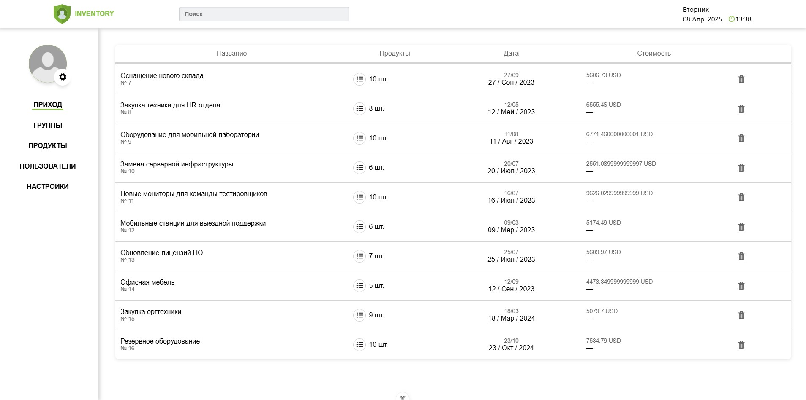

<div style="margin-top:0; padding-top:0" align="center">
<h1 style="margin-top:0">Orders & Products Demo App</h1>
  
<p>Single Page Application (SPA) для отображения заказов и продуктов, разработанное на Vue 3 + TypeScript с использованием Pinia, Vue Router и Socket.io.</p>


<p><b>Технологический стек:</b> Vue 3 (Composition API), Vue Router, Pinia, SCSS, Vite, TypeScript, ESLint & Prettier, Docker, Socket.io, Docker Compose, Node.js + Express (сервер)</p>
</div>

---

## 📦 Установка и запуск проекта

### 🔄 Вариант 1: запуск через Docker (рекомендуется)

> Убедитесь, что у вас установлены [Docker](https://www.docker.com/) и [Docker Compose](https://docs.docker.com/compose/).

```bash
git clone https://github.com/starik061/orders-project.git
cd orders-project
docker-compose up --build
```

После запуска:

- Фронтенд будет доступен по адресу: [http://localhost:5173](http://localhost:5173)
- Сервер с WebSocket — по адресу: [http://localhost:3000](http://localhost:3000)

---

### 🧪 Вариант 2: запуск вручную (без Docker)

#### 1. Запуск фронтенда (client)

```bash
cd client
npm install
npm run dev
```

#### 2. Запуск сервера (server) с Socket.io

```bash
cd server
npm install
node server.js
```

---

## 📁 Структура проекта

```
orders-project/
├── client/         # Vue-приложение (фронтенд)
├── server/         # Node.js сервер с Socket.io
├── docker-compose.yml
├── README.md
```

---

## 🔌 WebSocket-функционал

Приложение использует Socket.io для отображения **количества активных вкладок** в правом верхнем углу интерфейса (`TopMenu`). При открытии/закрытии вкладки счётчик обновляется в реальном времени.

---

## 🛠 Рекомендуемое окружение

[VSCode](https://code.visualstudio.com/) + [Volar](https://marketplace.visualstudio.com/items?itemName=Vue.volar)

---

## 🧰 Команды для фронтенда (внутри `client/`)

### Установка зависимостей

```bash
npm install
```

### Запуск в режиме разработки

```bash
npm run dev
```

### Сборка проекта

```bash
npm run build
```

### Проверка типов

```bash
npm run type-check
```

### Линтинг

```bash
npm run lint
```
